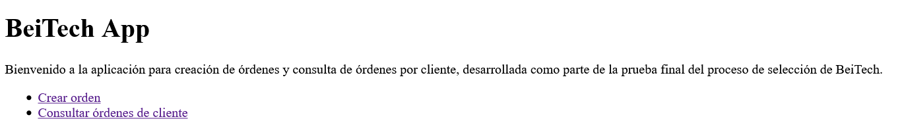
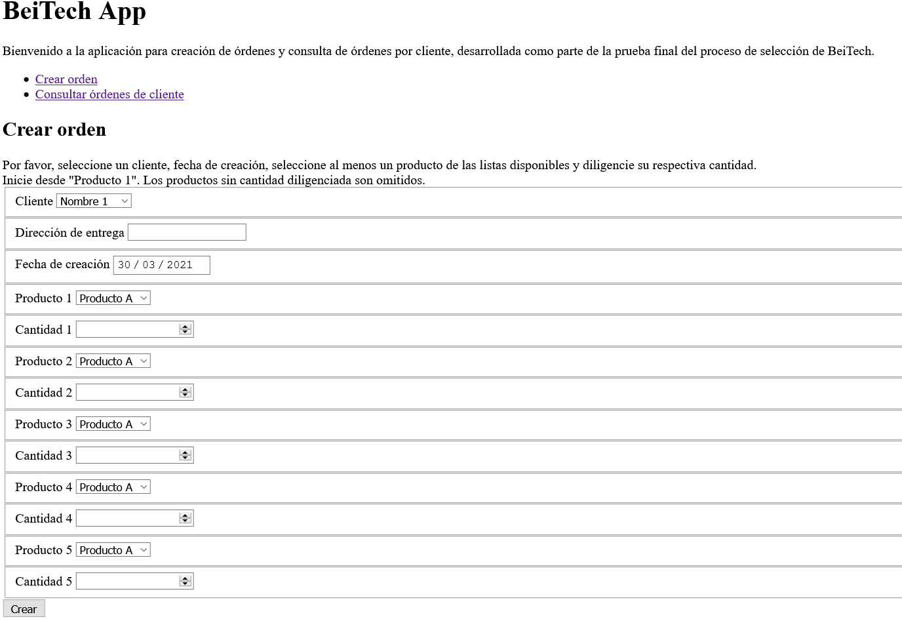
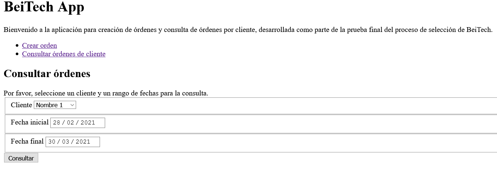
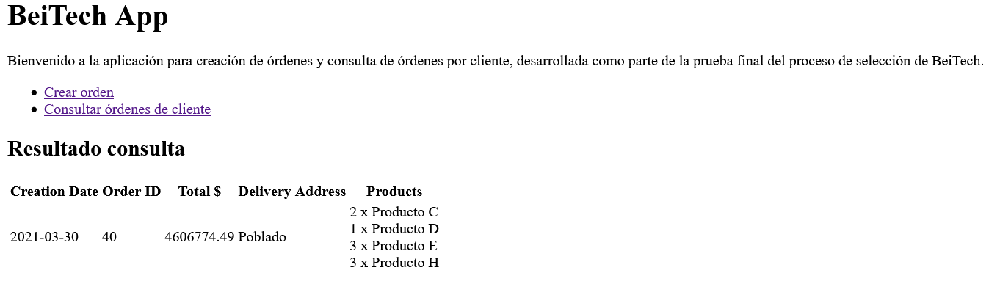
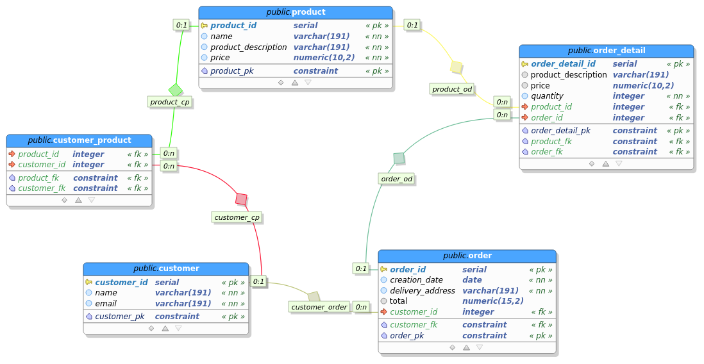
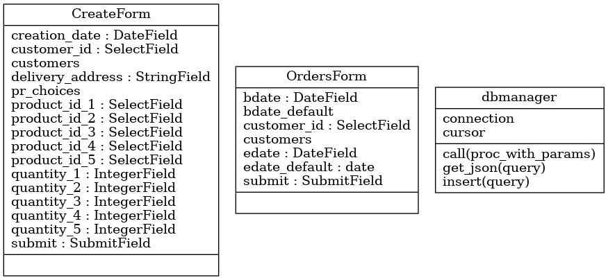
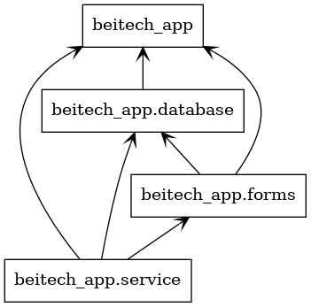

# beitech_prueba_practica
Repositorio con la implementación de la prueba práctica de la fase 4 del
proceso de selección de BeiTech.

## Instalación

Se requiere disponer de Ubuntu 20.04. Puede ser en instalación directa o a
través de WSL2. No se ha probado en otra distribución. Además de esto, se
espera mínimamente que el usuario disponga de git para inicial con el clonado
del repositorio.

```
git clone https://github.com/cosmoscalibur/beitech_prueba_practica.git
cd beitech_prueba_practica
cat apt.txt | xargs sudo apt install -y
pip3 install -r requirements.txt
pipenv install --pre
```

En este punto disponemos de las dependencias necesarias para el proyecto.

## Configuración de base de datos

Este paso debe ser realizado con un usuario de sistema que tenga acceso. Por
defecto, se crea el usuario `postgres` al cual le ha dado ya una contraseña
durante el proceso de instalación. Además de esto, le será solicitada una
contraseña para el usuario específico de la aplicación.

**Usuario**: beitech_user  
**Contraseña**: beitech2021

Use el usuario `postgres` y navegue hasta la ubicación del directorio `sql`, en
donde debe ejecutar `bash init_db.sh` e ingresar la contraseña indicada
anteriormente cuando sea solicitada.

Tenga presente que al ejecutar desde otra posición o usar el modo de ejecutar
como otro usuario de `su`, deberá cambiar las rutas de la rutina bash por rutas
absolutas.

En caso de cambiar la configuración por defecto, deberá modificar la sección `database` del archivo `beitech_app/settings.json`.

## Lanzar el servicio

Ubicado en el raíz del directorio, ejecute lo siguiente:

```
pipenv shell
python -m beitech_app.service
```

En caso de cambiar la configuración por defecto, deberá modificar la sección `service` del archivo `beitech_app/settings.json`.

Usando la configuración por defecto, puede abrir la aplicación en
http://127.0.0.1:5000 y acceder a las opciones con los enlaces disponibles.






## Datos de prueba

El reto solicita llenar los datos de clientes, productos y relación de
productos disponibles por cliente directamente en la base de datos. Esto fue
realizado en la sección de base de datos.

Para hacer un llenado rápido de prueba ejecutamos desde el directorio raíz del
proyecto, con el ambiente activado y el servicio en ejecución:
`python test/httpx_test_data.py`.

## Información adicional

En el directorio `beitech_app/swagger` encontrará archivos YML con
documentación de los métodos GET acorde a la especificación OpenAPI. Pendiente
terminar de desplegar con flasgger.

### Diagrama entidad relación

Se conserva el diseño original de la base de datos propuesto en el reto. Se pasa
la propuesta con PgModeler.



Se generan los diagramas de clase y paquete solicitados, usando pyreverse.



