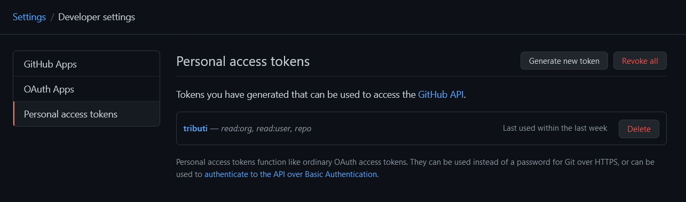
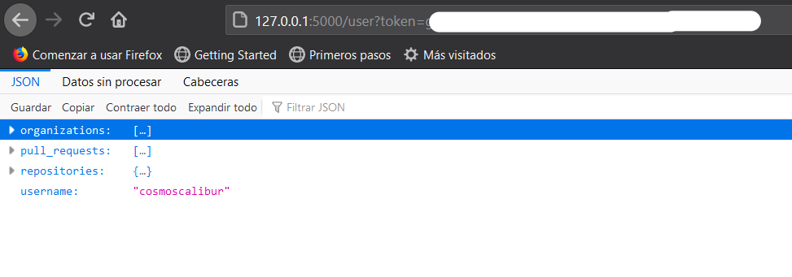
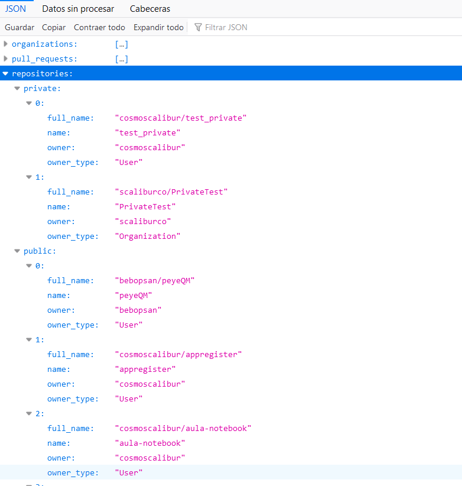
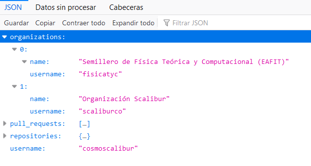
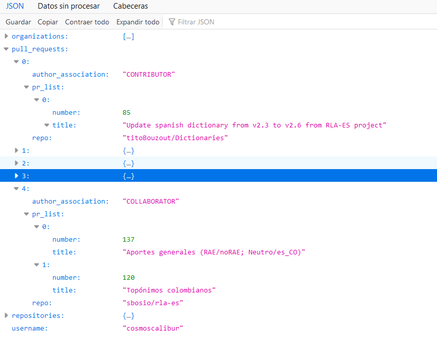

# Extracción de datos de usuario autenticado GitHub

Este repositorio contiene la implementación solicitada como parte de la prueba
técnica de Tributi. Se solicita implementar en Python una API REST con un solo
_endpoint_ que retorne un objeto JSON con la información acerca de un usuario
autenticado.

Esta información es:

+ Repositorios públicos y privados.  
+ Organizaciones a las que pertenece.  
+ _Pull requests_.  

## Dependencias

Se requiere de las siguientes dependencias (probadas):

+ Python=3.8
+ Flask=1.1
+ requests=2.24

Si dispone de Anaconda o Miniconda, se aporta archivo `environment.yml` para la
creación del entorno: `conda env create -f environment.yml` y posteriormente
activar como: `conda activate tributi`.

## Autenticación del usuario

Es necesario que para la autenticación, el usuario disponga de un _token_ de
acceso personal, el cual podrá crear acorde a las instrucciones de
["creating a personal access token"](https://docs.github.com/en/github/authenticating-to-github/creating-a-personal-access-token).

En la sección de [_settings_ >> _Developer settings_ >> __tokens_](https://github.com/settings/tokens),
genere un nuevo _token_ asignando los permisos de _read:org_, _read:user_ y
_repo_. Estos son los permisos requeridos para el correcto funcionamiento del servicio.

Precaución

No comparta el token anterior, dado que el manejo de repositorios privados es posible solo en modo de escritura. Quien tenga acceso a dicho token puede alterar los repositorios.

## Uso del servicio

El servicio implementa un único _endpoint_ `/user` y usa como parámetro `token`,
el cual corresponde al generado anteriormente. El servicio responde a los
métodos `get` y `post`, siendo recomendado el último por motivos de seguridad,
de manera que el _token_ no quede expuesto en el historial.  

El servicio se expone por protocolo HTTP, usando la configuración por defecto
de flask, http://127.0.0.1:5000/user. Lance el servicio ejecutando el archivo python: `python service.py`.

## Retorno

Se presenta una estructura general del objeto JSON separada en 4 componentes: el nombre de usuario y 3 arreglos correspondientes a los repositorios, organizaciones y _pull requests_.

Los repostorios se dividen en privados y públicos, correspondiendo a cada
categoría un arreglo de objetos JSON con la información del nombre del
repositorio, nombre completo del repositorio, propietario del repositorio y
tipo de usuario del propietario.

Las organizaciones se presentan como un arreglo de objetos JSON que presentan
la información de nombre de usuario de la organización y el nombre de la
organización.

Los _pull requests_ se presentan en un arreglo que agrupa estos por repositorio
(caso de uso típico, un usuario tendría más de un _PR_ por repo). Por repo en
el cual se ha realizado un _PR_, se presenta el nombre completo del repo, el
tipo de asociación del usuario al repositorio y un arreglo de _PR_ en dicho
repo, con el número del _PR_ y el título de este.

